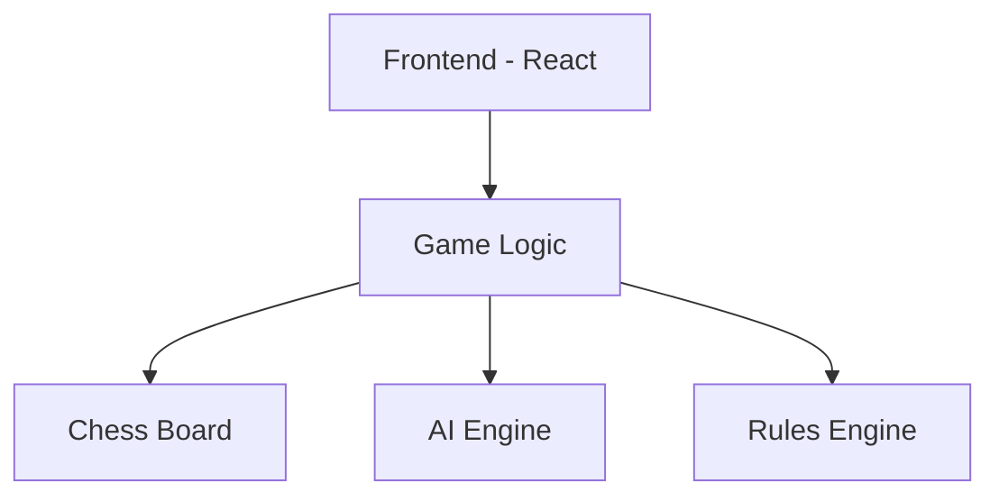

## 1. Architecture Design


## 2. Technology Description
- **Frontend**: React@18 + tailwindcss@3 + vite
- **Initialization Tool**: vite-init
- **Backend**: None（单机应用）
- **Database**: None（本地存储游戏状态）

## 3. Route Definitions
| Route | Purpose |
|-------|---------|
| / | 主菜单页面 |
| /rules | 规则讲解页面 |
| /ai | 人机对战页面 |
| /vs | 双人对战页面 |

## 5. Data Model
### 5.1 棋子数据结构
```typescript
interface Piece {
  type: '帅' | '仕' | '相' | '馬' | '車' | '炮' | '兵';
  color: 'red' | 'black';
  position: [number, number];
}
```

### 5.2 棋盘数据结构
```typescript
type Board = (Piece | null)[][];
```
