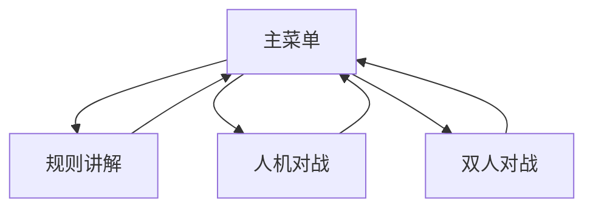

## 1. Product Overview
中国象棋教学软件是一款在Win10上运行的单机应用，旨在为初学者提供象棋规则学习、人机对战练习和双人对战功能，帮助用户快速掌握象棋技巧。

## 2. Core Features

### 2.2 Feature Module
1. **主菜单页面**：功能导航入口
2. **规则讲解页面**：棋子介绍、棋盘布局、规则说明
3. **人机对战页面**：与AI进行象棋对战
4. **双人对战页面**：本地双人对战

### 2.3 Page Details
| Page Name | Module Name | Feature description |
|-----------|-------------|---------------------|
| 主菜单页面 | 导航模块 | 展示三个主要功能入口，点击切换到对应页面 |
| 规则讲解页面 | 棋子介绍 | 展示各种棋子的名称、图片和走法说明 |
| 规则讲解页面 | 棋盘布局 | 交互式棋盘演示 |
| 规则讲解页面 | 规则说明 | 详细的象棋规则讲解 |
| 人机对战页面 | 棋盘界面 | 完整的象棋棋盘和棋子 |
| 人机对战页面 | 游戏控制 | 开始、暂停、悔棋、重新开始等功能 |
| 人机对战页面 | AI选择 | 选择不同难度的AI对手 |
| 双人对战页面 | 棋盘界面 | 完整的象棋棋盘和棋子 |
| 双人对战页面 | 游戏控制 | 开始、暂停、悔棋、重新开始等功能 |

## 3. Core Process
用户启动软件后，首先看到主菜单，选择进入规则讲解学习知识，或者进入人机对战/双人对战进行实战练习。

## 4. User Interface Design
### 4.1 Design Style
- **主色调**：深木色（#8B4513）和米黄色（#F5F5DC），营造传统棋盘氛围
- **辅助色**：红色（#DC143C）和黑色（#000000）用于区分双方棋子
- **按钮风格**：圆角矩形，木质纹理效果
- **字体**：宋体/楷体，传统中文书法风格
- **布局风格**：居中布局，卡片式设计
- **图标风格**：中国传统象棋元素

### 4.2 Page Design Overview
| Page Name | Module Name | UI Elements |
|-----------|-------------|-------------|
| 主菜单页面 | 导航模块 | 三个大功能按钮，居中排列，背景为木质纹理 |
| 规则讲解页面 | 棋子介绍 | 左右分栏，左侧棋子列表，右侧详细说明 |
| 规则讲解页面 | 棋盘布局 | 交互式棋盘展示 |
| 人机对战页面 | 棋盘界面 | 完整的象棋棋盘，红黑双方棋子 |
| 人机对战页面 | 游戏控制 | 底部控制栏，包含各种操作按钮 |

### 4.3 Responsiveness
- 桌面端优先设计，适配Win10屏幕分辨率
- 支持窗口缩放，棋盘自适应
